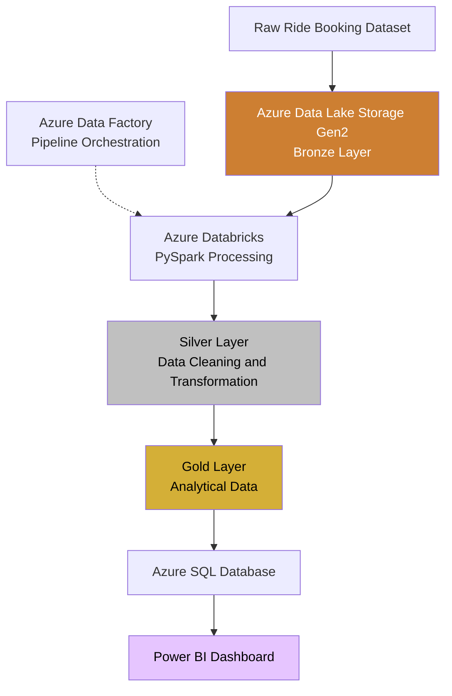

# Rapido Ride Analysis – Data Architecture

```mermaid
flowchart TD
    A["Raw Ride Booking Dataset"] --> B["Azure Data Lake Storage Gen2<br/>Bronze Layer"]

    C["Azure Data Factory<br/>Pipeline Orchestration"] -.-> D["Azure Databricks<br/>PySpark Processing"]

    B --> D
    D --> E["Silver Layer<br/>Data Cleaning and Transformation"]
    E --> F["Gold Layer<br/>Analytical Data"]
    F --> G["Azure SQL Database"]
    G --> H["Power BI Dashboard"]

    style B fill:#CD7F32,color:#fff
    style E fill:#C0C0C0,color:#000
    style F fill:#D4AF37,color:#000
    style H fill:#E6C5FF,color:#000
```
